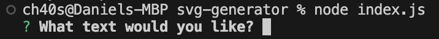
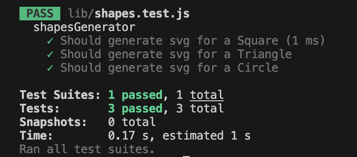

For more information on MIT visit https://opensource.org/licenses/MIT

# SVG Generator
This is a SVG generator. It makes it easy to generate a simple svg on the go with very little work.
  
## Table of Contents
* [Installation](#installation)
* [Usage](#usage)
* [Contribute](#contribute)
* [License](#license)
* [Tests](#tests)
* [Questions](#questions)
  
## Installation
I recommend to download the zip file then generate the svg. After just copy the SVG to the main project.
  
## Usage
Use nodejs and install inquirer version 8.2.4 using npm, or just < npm i > in the terminal. After, run the file using node in the terminal, then asnswer the questions.  
  
* When in the terminal type node index.js and answer the questions.
* navigate to the lib folder and open the logo.svg generated.

## Contribute
Fork or clone the repository then make a commit.
  
## License

MIT License

Permission is hereby granted, free of charge, to any person obtaining a copy
of this software and associated documentation files (the "Software"), to deal
in the Software without restriction, including without limitation the rights
to use, copy, modify, merge, publish, distribute, sublicense, and/or sell
copies of the Software, and to permit persons to whom the Software is
furnished to do so, subject to the following conditions:

Copyright (c) 2023 Daniel Zarate
  
## Tests
  

* For more tests download jest, and run < npm test > while in the lib folder.

## Questions 
Github: https://github.com/Ch40s1

Email: zaratedaniel67@gmail.com email me for any questions.

Video Walkthrough: